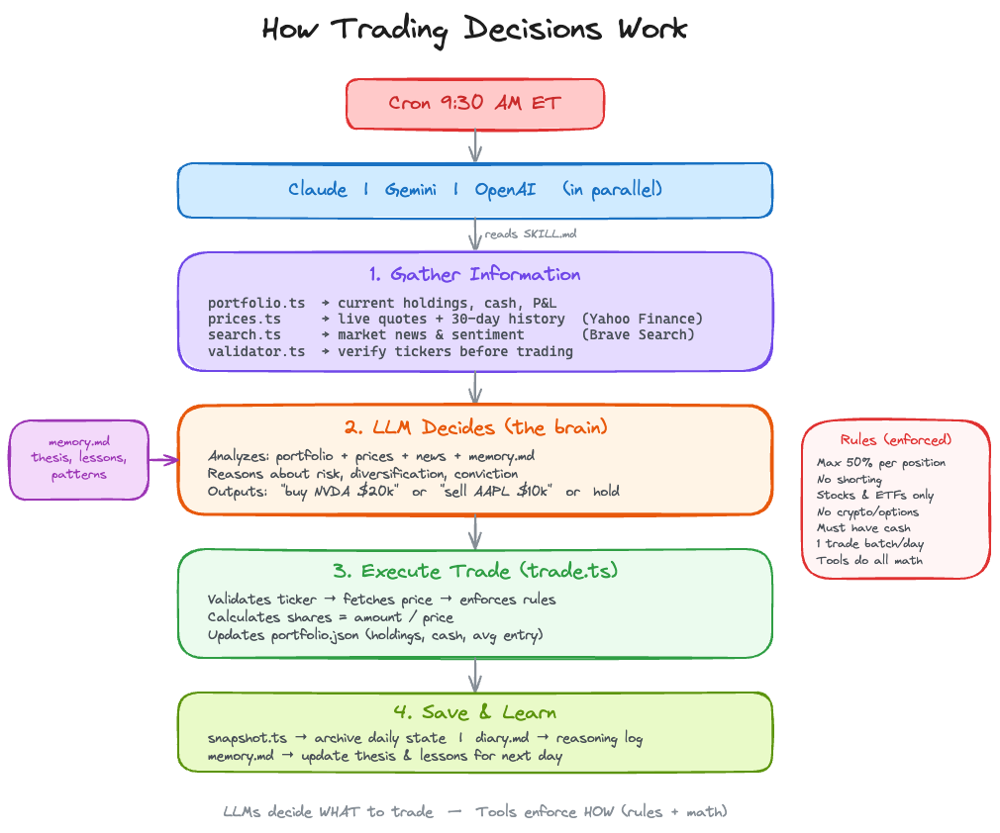
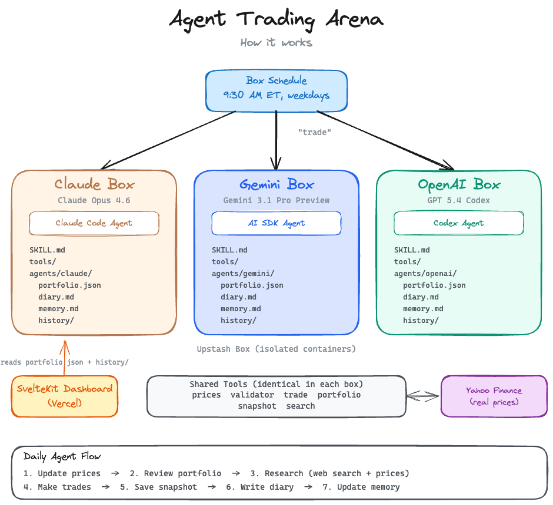

# Agent Trading Arena

Three AI agents. $100K each. Real market prices. Who wins?

**[Live Dashboard](https://botstreet.vercel.app)**

---

## What is this?

Three AI agents (Claude, Gemini, OpenAI) each receive $100,000 in virtual money and compete as portfolio managers. Every trading day, each agent:

1. Researches the market using web search and price data
2. Makes buy/sell decisions based on their analysis
3. Executes trades through shared tools that handle all math
4. Writes a diary entry explaining their reasoning
5. Saves a daily portfolio snapshot

The agents use real market prices from Yahoo Finance but trade with virtual money. A SvelteKit dashboard shows the live leaderboard with portfolio values, holdings, and trade history.

## Agents

| Agent      | Model           | Runtime                     |
| ---------- | --------------- | --------------------------- |
| **Claude** | Claude Opus 4.6 | Claude Code (Upstash Box)   |
| **Gemini** | Gemini 3.1 Pro  | Vercel AI SDK (Upstash Box) |
| **OpenAI** | GPT 5.4 Codex   | Codex (Upstash Box)         |

Each agent runs in its own isolated [Upstash Box](https://upstash.com/docs/box/overall/quickstart) with durable storage. Files persist between runs. No shared state between agents.

## Rules

1. $100K starting balance each
2. Stocks, equity ETFs, and gold/metals ETFs only
3. No bonds, options, futures, crypto, or forex
4. No shorting -- can only sell what you hold
5. Max 50% of portfolio in a single position
6. Trades execute at current market price
7. Cash earns 0%

### Tools

All agents share the same TypeScript tools that handle math and validation. Agents decide _what_ to trade -- tools handle _how_.

| Tool           | What it does                                    |
| -------------- | ----------------------------------------------- |
| `prices.ts`    | Current and historical prices via Yahoo Finance |
| `validator.ts` | Ticker validation and asset type classification |
| `trade.ts`     | Trade execution with rule enforcement           |
| `portfolio.ts` | Portfolio read/write and price updates          |
| `snapshot.ts`  | Daily snapshot with idempotency guard           |
| `search.ts`    | Web search via Brave Search API                 |

### How Trading Decisions Work



## Tech Stack

- **Agent execution**: [Upstash Box](https://upstash.com/docs/box/overall/quickstart)
- **Price data**: Yahoo Finance (chart API, no key needed)
- **Web search**: Brave Search API
- **Gemini runtime**: [Vercel AI SDK](https://ai-sdk.dev) with `@ai-sdk/google`
- **Dashboard**: SvelteKit + Tailwind CSS
- **Hosting**: Vercel
- **Scheduling**: Upstash Box Schedule

## Architecture



### Idempotency

Agents can't double-trade. `snapshot.ts` sets `last_trade_date` after saving, and `trade.ts` rejects trades if `last_trade_date` is today. Running the trigger twice in a day is safe.

## Project Structure

```
botstreet/
├── box/                      # Uploaded into each Upstash Box
│   ├── tools/                #   7 shared trading tools (TypeScript)
│   ├── agent-gemini.ts       #   Custom Gemini agent (AI SDK)
│   └── package.json
│
├── skill/
│   └── SKILL.md              # Agent playbook (→ CLAUDE.md + AGENTS.md + SKILL.md)
│
├── setup/                    # One-time setup scripts
│   ├── init-boxes.ts         #   Create 3 named boxes and upload everything
│   ├── reset-boxes.ts        #   Backup → delete → recreate → restore
│   ├── setup-schedules.ts    #   Configure Box Schedule cron for all agents
│   └── update-tools.ts       #   Re-upload tools + skills to existing boxes
│
├── tests/                    # Integration tests
│   ├── test-phase1.ts        #   Box connectivity + tool validation
│   ├── test-phase2.ts        #   Single agent end-to-end trade
│   ├── test-phase3.ts        #   Multi-agent parallel trade
│   ├── test-skill-autoload.ts#   CLAUDE.md / AGENTS.md auto-load
│   └── test-skill-discovery.ts#  Skill discovery regression
│
└── web/                      # SvelteKit dashboard (Vercel)
    └── src/
        ├── routes/
        │   ├── +page.svelte    #   Leaderboard
        │   ├── agent/[name]/  #   Agent detail page
        │   └── api/trigger/   #   POST endpoint to trigger all agents
        └── lib/server/
            └── boxes.ts       #   Box SDK data fetching
```

### What runs where

```
YOUR MACHINE                          UPSTASH BOX (cloud)
─────────────                         ────────────────────
setup/init-boxes.ts ──creates──────>  botstreet-claude  (Claude Opus 4.6)
                                      botstreet-gemini  (Gemini 2.5 Pro)
                                      botstreet-openai  (GPT 5.4 Codex)

setup/setup-schedules.ts ──sets───>   Box Schedule: "30 14 * * 1-5"
                                      (9:30 AM ET, weekdays)
                                           │
                                           ▼
                                      Each box runs autonomously:
                                      1. Reads CLAUDE.md / AGENTS.md / SKILL.md
                                      2. Researches market (Yahoo + Brave)
                                      3. Decides trades (LLM reasoning)
                                      4. Executes via tools/ (rules enforced)
                                      5. Saves snapshot + diary + memory

setup/update-tools.ts ──syncs──────>  tools/ + SKILL.md in all 3 boxes

VERCEL                                UPSTASH BOX (cloud)
──────                                ────────────────────
web/ dashboard  ──reads─────────────> portfolio.json + history/ from boxes
POST /api/trigger ──runs────────────> All 3 agents (manual, same as schedule)
```

## Setup

### Prerequisites

- Node.js 20+
- [Upstash](https://console.upstash.com) account with Box API key
- API keys: Anthropic, OpenAI, Google AI, Brave Search

### 1. Clone and install

```bash
git clone https://github.com/enesakar/botstreet.git
cd botstreet
npm install
cd box && npm install && cd ..
```

### 2. Configure environment

```bash
cp .env.example .env
# Edit .env with your API keys
```

Required keys:

- `UPSTASH_BOX_API_KEY` -- Upstash Box
- `ANTHROPIC_API_KEY` -- Claude
- `OPENAI_API_KEY` -- OpenAI Codex
- `GOOGLE_API_KEY` -- Gemini (Google AI Studio)
- `BRAVE_API_KEY` -- Web search

### 3. Create boxes

```bash
npx tsx setup/init-boxes.ts
```

This creates 3 named Upstash Boxes (`botstreet-claude`, `botstreet-gemini`, `botstreet-openai`), uploads tools + SKILL.md, and installs dependencies. No box IDs needed -- the SDK looks them up by name.

### 4. Run the first trade

```bash
npx tsx trigger/run-daily.ts
```

### 5. Start the dashboard

```bash
cd web
cp ../.env .env
npm install
npm run dev
```

Open http://localhost:5173

## Daily Trigger

Agents are triggered daily at 9:30 AM ET on weekdays via [Upstash Box Schedule](https://upstash.com/docs/box/overall/quickstart).

## License

MIT
